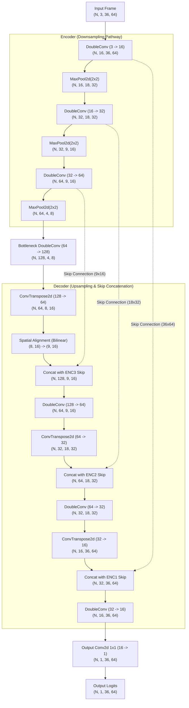
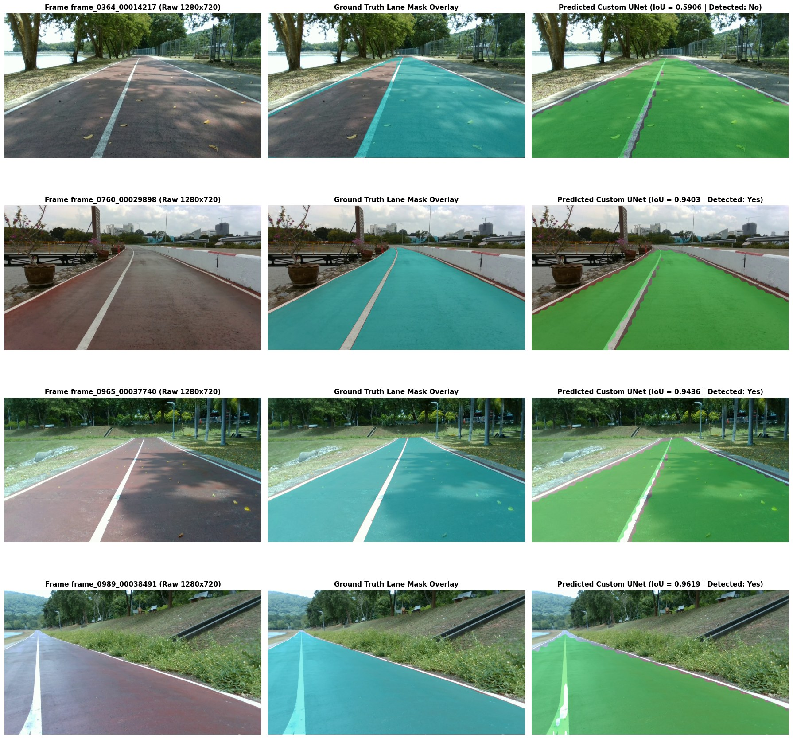

# Custom Lane Segmentation UNet (from scratch) — PSU-Reservoir Dataset

[](https://pytorch.org/)
[](https://python.org/)
[](https://developer.nvidia.com/cuda-zone)

โครงงานพัฒนาระบบแบ่งส่วนเลนถนน (Lane Segmentation) ด้วยโมเดล Convolutional Neural Network แบบ UNet ที่ออกแบบโครงสร้างขึ้นเองและฝึกฝนโมเดลใหม่ทั้งหมด **ตั้งแต่เริ่มต้น (From Scratch)** ด้วย PyTorch:
- **Zero Pretrained Weights**: ไม่ใช้ pretrained backbones ใดๆ (ไม่มี ImageNet หรือ ResNet) เริ่มต้นสุ่มค่าน้ำหนักใหม่ทั้งหมด
- **Zero External Segmentation Libraries**: ไม่พึ่งพาไลบรารีสำเร็จรูปภายนอก เช่น `segmentation_models_pytorch`, `torchvision.models.segmentation` หรือ `ultralytics`
- **Laptop-Friendly Footprint**: โมเดลมีขนาดกะทัดรัด (~0.483M parameters, ความเร็ว inference ~2.0 ms บน GPU, ~26.8 ms บน CPU, ใช้ VRAM ต่ำกว่า 5 MB) สามารถเทรนและใช้งานได้บนเครื่องคอมพิวเตอร์ทั่วไป

---

## 1. ข้อมูลชุดข้อมูล (Dataset) และการแบ่งข้อมูล (Data Splitting)

### ชุดข้อมูล PSU-Reservoir Lane Dataset (Assignment-8)
ชุดข้อมูลประกอบด้วยภาพเฟรมวิดีโอบันทึกการขับขี่รอบอ่างเก็บน้ำ ม.อ. (PSU reservoir track) จำนวน **1,000 เฟรม** ที่ความละเอียดดั้งเดิม **1280x720 พิกเซล** (อัตราส่วน 16:9) โดยมี annotation ในรูปแบบ Ultralytics YOLO format

- **การคัดกรอง Label เฉพาะ Lane Polygon**: ในไฟล์ label ดิบมี annotation ปะปนกันหลายประเภท:
  - Bounding Boxes (5 ค่า: `class_id x y w h`) — **ไม่นำมาใช้งาน (ถูกข้ามทั้งหมด)**
  - Polylines เส้นกึ่งกลาง (3 คลาส) — **ไม่นำมาใช้งาน (ถูกข้ามทั้งหมด)**
  - Lane Boundary Polygons (`0 x1 y1 x2 y2 ... xn yn`) ที่มีพิกัดตั้งแต่ 3 จุดขึ้นไป — **นำมาใช้งานเฉพาะส่วนนี้**
- **กำหนด Lane Class ID ได้**: รองรับการระบุผ่าน CLI arg `--lane-class-id` (ค่าเริ่มต้นคือ `0`) โดยระบบจะกรองบรรทัดที่มีพิกัดน้อยกว่า 3 จุดทิ้งโดยอัตโนมัติ
- **Rasterization ที่ความละเอียดดั้งเดิม**: แปลงพิกัด Polygon เป็น Binary Mask ขนาด 1280x720 พิกเซลด้วย `cv2.fillPoly` ก่อนที่จะย่อขนาด (Resize) ภาพและ Mask พร้อมกันไปยังขนาดที่โมเดลรับ (64x36)
- **สถิติของชุดข้อมูล (Dataset Statistics)**:
  - จำนวนภาพทั้งหมด: **1,000 ภาพ**
  - จำนวนภาพที่ไม่มีเลน (Empty Lane Mask): **0 ภาพ (0.00%)**
  - สัดส่วนพื้นที่เลนเฉลี่ยต่อเฟรม: **49.65%** (ประมาณครึ่งหนึ่งของเฟรมเป็นพื้นที่ผิวทางวิ่ง)

### การแบ่งชุดข้อมูล (65:35 Split)
- **Train Set 65% (650 ภาพ)**: บันทึกรายชื่อใน [`splits/train.txt`](splits/train.txt)
- **Test Set 35% (350 ภาพ)**: บันทึกรายชื่อใน [`splits/test.txt`](splits/test.txt)
- **Validation Set (10% ของ Train = 65 ภาพ)**: สุ่มแยกออกมาจากชุด Train สำหรับใช้คัดเลือก Checkpoint ที่ดีที่สุดระหว่างการเทรน (`best.pt`)
- **ความโปร่งใสเรื่อง Data Contamination**: ในระดับ Image-level ไม่มีการนำภาพในชุด Test ไปใช้ในการฝึกสอนหรือคัดเลือก Checkpoint แต่อย่างใด อย่างไรก็ตาม เนื่องจากภาพเฟรมมาจากวิดีโอต่อเนื่อง เฟรมข้างเคียงจึงมีความคล้ายคลึงกันสูง (โปรดดูรายละเอียดเพิ่มเติมในหัวข้อ ข้อจำกัดและข้อคิดเห็นทางวิศวกรรม)

### รายละเอียดการเทรนและการทำ Data Augmentation
- **Photometric Augmentation** (ใช้เฉพาะช่วงเทรนบนภาพความละเอียดดั้งเดิม 1280x720):
  - Small White-balance Shift: สุ่มคูณ Gain แต่ละช่องสี RGB ในช่วง `[0.92, 1.08]` (ความน่าจะเป็น 0.5)
  - Small Brightness Shift: สุ่มบวก/ลบค่าความสว่างในช่วง `[-25.0, +25.0]` จำลองแสงแดดและเงา (ความน่าจะเป็น 0.5)
  - Light Gaussian Blur: สุ่มเบลอด้วย Kernel ขนาด 3x3 หรือ 5x5 (ความน่าจะเป็น 0.3)
- **TensorBoard Logging**: บันทึก Log การเทรนอัตโนมัติในไดเรกทอรี `runs/unet_lane` สามารถเปิดดูได้ผ่านคำสั่ง:
  ```bash
  tensorboard --logdir runs
  ```

---

## 2. โครงสร้าง Neural Network ที่ออกแบบและเหตุผลประกอบ

รายละเอียดสถาปัตยกรรมและตารางวิเคราะห์ขนาด Layer อย่างละเอียดแสดงไว้ในเอกสาร [`custom-unet-architecture.md`](custom-unet-architecture.md)



### เหตุผลและหลักการออกแบบโครงสร้าง (Architectural Rationale):
1. **เลือกใช้โครงสร้าง UNet (Encoder-Decoder with Skip Connections)**:
   โมเดลแบบ UNet ช่วยดึง Context ของภาพในระดับสูงผ่าน Encoder และฟื้นฟูมิติเชิงพื้นที่ผ่าน Decoder โดยมี Skip Connection ส่งต่อ Low-level Spatial Features ข้ามไปประกบกับ Decoder โดยตรง ทำให้รักษาตำแหน่งขอบเขตเลนถนนได้อย่างคมชัด ไม่สูญเสียรายละเอียดพิกเซล
2. **ขนาด Input 64x36 พิกเซล (คงอัตราส่วน 16:9 ตามวิดีโอดั้งเดิม)**:
   ภาพต้นฉบับมีขนาด 1280x720 พิกเซล (อัตราส่วน 16:9) การใช้ Input แบบสี่เหลี่ยมจัตุรัส (เช่น 48x48 หรือ 64x64) จะบีบอัดมิติแนวนอนและทำให้มุมมองถนนบิดเบี้ยว การกำหนดขนาด 64x36 จึงคงอัตราส่วนจริงไว้ได้อย่างสมบูรณ์ และมีขนาดเพียง 2,304 จุดต่อช่องสัญญาณ ช่วยให้สามารถรันบนคอมพิวเตอร์ทั่วไปหรือ Laptop ได้อย่างรวดเร็ว
3. **การ Downsample 3 ระดับสำหรับมิติความสูง H=36**:
   เมื่อหารมิติความสูง $H=36$ ลงทีละ 2 จะได้ $36 \rightarrow 18 \rightarrow 9 \rightarrow 4$ (ผ่าน Integer Division `9 // 2 = 4`) หาก Downsample อีกระดับจะเหลือความสูงเพียง 2 ซึ่งสูญเสียรูปร่างแนวตั้งของถนน การจำกัดไว้ที่ 3 ระดับทำให้ Bottleneck มีขนาด $8 \times 4$ พิกเซล ซึ่งคงความต่อเนื่องของเส้นทางไว้ได้เหมาะสม
4. **การจัดการมิติเลขคี่ในฝั่ง Upsampling**:
   เนื่องจาก $9 // 2 = 4$ เมื่อทำการ `ConvTranspose2d` ด้วย Stride 2 จะได้ขนาด $4 \times 2 = 8$ ซึ่งไม่ตรงกับขนาด 9 ของ Skip Connection โมดูล `Up` จึงได้รับการออกแบบให้ตรวจสอบและปรับขนาดอัตโนมัติด้วย `F.interpolate(x, size=skip.shape[2:], mode="bilinear")` ก่อนทำการ Concatenation
5. **ขนาด Channel Width และจำนวน Parameter**:
   กำหนด Base Channel เป็น 16 (`16 -> 32 -> 64 -> 128`) ทำให้โมเดลมีพารามิเตอร์รวมทั้งสิ้น **482,737 พารามิเตอร์ (~0.483M)** ซึ่งช่วยให้โมเดลมีขนาดเล็ก เหมาะสำหรับการประมวลผลบน Laptop
6. **โมดูล DoubleConv ร่วมกับ BatchNorm และ ReLU**:
   การใช้ Convolution 3x3 สองชั้นช่วยเพิ่ม Receptive Field และการใส่ `BatchNorm2d` ช่วยให้การ Optimize โมเดลทำได้ง่ายขึ้นเมื่อเริ่มต้นเทรนใหม่ตั้งแต่ต้น (Training from scratch)
7. **ฟังก์ชัน Loss รวม (BCE + Soft Dice Loss)**:
   การผสมผสานระหว่าง Binary Cross-Entropy (ช่วยเรื่อง Gradient ในระดับพิกเซล) และ Soft Dice Loss (ช่วยเพิ่มความทับซ้อนเชิงพื้นที่โดยตรง):
   $$\mathcal{L}_{\text{total}} = 0.5 \times \mathcal{L}_{\text{BCE}} + 0.5 \times \mathcal{L}_{\text{Dice}}$$

---

## 3. กราฟ Loss และการลู่เข้าของโมเดล (Loss Convergence & Training History)

ฝึกฝนโมเดลเป็นเวลา **30 Epochs** ด้วย Adam Optimizer (`lr = 1e-3`, Batch Size 4) บนคอมพิวเตอร์ส่วนบุคคล


### การวิเคราะห์การลู่เข้าและปรากฏการณ์ Overfitting:
- **การลู่เข้าที่รวดเร็ว (Epochs 1–5)**:
  ค่า Training Loss ลดลงอย่างรวดเร็วจาก 0.2357 ใน Epoch ที่ 1 ลงเหลือ 0.0411 ใน Epoch ที่ 5 และ Validation IoU พุ่งแตะระดับ 0.978 ตั้งแต่ Epoch ที่ 3
- **จุดที่โมเดลให้ประสิทธิภาพดีที่สุด (Epoch 21)**:
  Validation Loss แตะจุดต่ำสุดที่ **Epoch 21** (`val_loss = 0.0131`, `val_iou = 0.9874`) ซึ่งเป็นจุดที่บันทึก Checkpoint สำหรับนำไปทดสอบจริงไว้ที่ [`checkpoints/unet_lane/best.pt`](checkpoints/unet_lane/best.pt)
- **การประเมินสภาวะ Overfitting**:
  ช่องว่างระหว่าง Train Loss และ Validation Loss มีขนาดเล็ก ไม่พบสภาวะ Overfitting ที่รุนแรง อย่างไรก็ตาม เนื่องจากชุด Validation ประกอบด้วยภาพเพียง 65 ภาพ เส้นกราฟ Validation จึงมีความแปรปรวนและผันผวนระหว่าง Epoch (หลังจาก Epoch 21 ค่า Validation Loss แกว่งตัวอยู่ในช่วง 0.0165 ถึง 0.0303 และ Validation IoU อยู่ในช่วง 0.9746 ถึง 0.9839 ตามข้อมูลจริงใน [`results/history.csv`](results/history.csv))
- **ความแตกต่างระหว่าง Scale ของ Validation IoU และ Test IoU**:
  Validation IoU ในตารางบันทึกการเทรนคำนวณที่มิติ $64 \times 36$ พิกเซลเทียบกับ Mask ที่ถูกย่อขนาดลงมา ขณะที่ Test IoU (0.9329) คำนวณบนความละเอียดเต็ม $1280 \times 720$ พิกเซลหลังจาก Upsample กลับ ซึ่งมีความคลาดเคลื่อนระดับขอบพิกเซลมากกว่า นอกจากนี้ ในโหมด Random Split ภาพชุด Validation ยังเป็นเฟรมที่อยู่ข้างเคียงกับภาพในชุด Train

---

## 4. ค่าการวัดผลประสิทธิภาพของโมเดล (Performance Metrics)

ประเมินผลบนภาพชุดทดสอบ **350 ภาพ (Held-Out 35% Test Set)** ที่ความละเอียดดั้งเดิม **1280x720 พิกเซล** โดยวัดค่าความทับซ้อน Intersection-over-Union (IoU):

$$\text{IoU} = \frac{|\text{Prediction} \cap \text{Ground Truth}|}{|\text{Prediction} \cup \text{Ground Truth}|}$$

กำหนดเกณฑ์ภาพที่ถือว่าตรวจจับเลนสำเร็จ (**Positive Detection**) เมื่อ $\text{IoU} \ge 0.60$

| Metric | ผลการทดสอบ | รายละเอียดเพิ่มเติม |
|---|---|---|
| **จำนวนเฟรมทดสอบทั้งหมด** | **350 เฟรม** | คิดเป็น 35% ของชุดข้อมูล (Held-out) |
| **เกณฑ์การตรวจจับสำเร็จ (Detection Threshold)** | `IoU >= 0.60` | กำหนดได้ผ่าน `--iou-threshold` |
| **จำนวนเฟรมที่ตรวจจับสำเร็จ (Positive Detected)** | **349 / 350 เฟรม** | มีเพียง 1 เฟรมที่ได้ค่าต่ำกว่า 0.60 |
| **อัตราการตรวจจับสำเร็จ (Detection Rate)** | **99.71%** | Positive Detection Rate |
| **ค่าเฉลี่ย IoU เฉพาะภาพที่ตรวจจับสำเร็จ** | **0.9339** (93.39%) | Mean IoU บนกลุ่มภาพที่ตรวจจับสำเร็จ |
| **ค่าเฉลี่ย IoU รวมทุกภาพทดสอบ (All Test Images)** | **0.9329** (93.29%) | Overall Benchmark บนชุดทดสอบ 350 ภาพ |

รายละเอียดค่า IoU แยกรายภาพบันทึกไว้ใน [`results/test_eval_per_image.csv`](results/test_eval_per_image.csv) และสรุปภาพรวมใน [`results/metrics.json`](results/metrics.json)

---

## 5. การทดลองเปรียบเทียบระหว่าง Random Split และ Temporal Split

เพื่อทดสอบผลกระทบของการรั่วไหลของข้อมูลเวลา (Temporal Correlation) ระหว่างเฟรมวิดีโอที่อยู่ติดกัน เราได้ทำการทดลองเปรียบเทียบโดยฝึกฝนโมเดลอีกตัวหนึ่งด้วยตัวเลือก `--split-mode temporal` ในโหมดนี้ข้อมูลจะถูกเรียงตามลำดับเวลา โดยนำ 65% แรกของการขับขี่ (650 เฟรม) มาใช้เทรน (และนำ 65 เฟรมสุดท้ายของช่วงนี้มาเป็นชุด Validation) ส่วน 35% ท้ายสุดของการขับขี่ (350 เฟรม) ถูกแยกไว้เป็นชุดทดสอบที่ไม่เคยผ่านตามาก่อน

| ตัวชี้วัด (Metric) | Random Split (65:35) | Temporal Split (65:35) | ความแตกต่าง (Difference) |
|---|---|---|---|
| **ไฟล์บันทึกรายชื่อชุดทดสอบ** | [`splits/test.txt`](splits/test.txt) | [`splits_temporal/test.txt`](splits_temporal/test.txt) | คนละชุดเฟรมกัน |
| **จำนวนเฟรมทดสอบ** | 350 | 350 | — |
| **เกณฑ์การตรวจจับสำเร็จ** | `IoU >= 0.60` | `IoU >= 0.60` | — |
| **จำนวนเฟรมที่ตรวจจับสำเร็จ** | **349 / 350** | **346 / 350** | -3 เฟรม |
| **อัตราการตรวจจับสำเร็จ (Detection Rate)** | **99.71%** | **98.86%** | **-0.85 pp** |
| **ค่าเฉลี่ย IoU เฉพาะภาพที่ตรวจจับสำเร็จ** | **0.9339** (93.39%) | **0.9247** (92.47%) | **-0.0092** |
| **ค่าเฉลี่ย IoU รวมทุกภาพทดสอบ** | **0.9329** (93.29%) | **0.9196** (91.96%) | **-0.0133** |


### การวิเคราะห์ผลการทดลอง:
- ผลคะแนนที่ลดลงเล็กน้อย (Detection Rate ลดลง 0.85 pp และค่าเฉลี่ย IoU ลดลง 0.0133) **สอดคล้องกับข้อสันนิษฐาน (suggests)** ว่าการแบ่งข้อมูลแบบสุ่ม (Random Split) มีความคาดหวังที่สูงเกินจริงเล็กน้อยเนื่องจากความต่อเนื่องทางเวลาของเฟรมวิดีโอ
- **ข้อสังเกตและข้อจำกัดสำคัญ (Caveat)**: ชุดทดสอบทั้งสองเป็นการนำเฟรมที่ **แตกต่างกัน** มาประเมิน (Random Split สุ่ม 350 เฟรมกระจายทั่วทั้งคลิป ส่วน Temporal Split นำ 350 เฟรมสุดท้ายตามลำดับเวลามาประเมิน) ซึ่งช่วงท้ายของการขับขี่อาจมีสภาพเส้นทาง มุมโค้ง หรือสภาพแสงที่ท้าทายกว่าช่วงแรก ดังนั้นความแตกต่างของคะแนนจึงไม่ได้เกิดจากการรั่วไหลของข้อมูลทางเวลาเพียงอย่างเดียว
- **เฟรมที่ไม่ผ่านเกณฑ์ 4 เฟรมใน Temporal Split** (จาก [`results/test_eval_per_image_temporal.csv`](results/test_eval_per_image_temporal.csv)):
  1. `frame_0921_00036276.jpg` (IoU: 0.363)
  2. `frame_0985_00038432.jpg` (IoU: 0.559)
  3. `frame_0986_00038443.jpg` (IoU: 0.402)
  4. `frame_0987_00038450.jpg` (IoU: 0.568)
  โดยค่า IoU ต่ำสุดอยู่ที่ 0.363 (เทียบกับ 0.591 ใน Random Split) และพบว่าเฟรมที่ไม่ผ่านเกณฑ์เหล่านี้กระจุกตัวอยู่ที่ช่วงท้ายสุดของวิดีโอ (เฟรมที่ 921 และ 985–987) รายละเอียดผลการทดลองบันทึกไว้ใน [`results/metrics_temporal.json`](results/metrics_temporal.json)

---

## 6. ตัวอย่างภาพ (Snapshot) ก่อน/หลัง การ Inference

ภาพตัวอย่างการแบ่งส่วนเลนที่ความละเอียดดั้งเดิม 1280x720 พิกเซล แสดงเปรียบเทียบ: **ภาพต้นฉบับ | Ground Truth Overlay (Cyan) | โมเดลทำนาย (Green)**



### ข้อมูลประสิทธิภาพรายเฟรม (จาก [`results/test_eval_per_image.csv`](results/test_eval_per_image.csv)):
1. **Frame 0989 (`frame_0989_00038491.jpg`)**: IoU = **0.9619**, Detected = **Yes**
2. **Frame 0965 (`frame_0965_00037740.jpg`)**: IoU = **0.9436**, Detected = **Yes**
3. **Frame 0760 (`frame_0760_00029898.jpg`)**: IoU = **0.9403**, Detected = **Yes**
4. **Frame 0364 (`frame_0364_00014217.jpg`)**: IoU = **0.5906**, Detected = **No**

---

## 7. การวิเคราะห์กรณีที่ไม่ผ่านเกณฑ์ (Failure Case Analysis)

ภาพเฟรมเดียวในชุดทดสอบ Random Split (350 ภาพ) ที่ได้ค่า IoU ต่ำกว่าเกณฑ์ 0.60 คือ `frame_0364_00014217.jpg` (IoU = **0.5906**):


### การวิเคราะห์จากหลักฐานเชิงประจักษ์:
- **ลักษณะทางกายภาพในภาพ**:
  ในภาพ `frame_0364` ทางวิ่งจริงเป็นถนนผิวทางสีแดง 2 เลนแบ่งด้วยเส้นแบ่งกึ่งกลางสีขาว เมื่อตรวจสอบภาพ Ground Truth (สีฟ้า Cyan) พบว่าผู้ทำ Annotation ทำการมาร์กเฉพาะ **เลนขวาเพียงเลนเดียว** (ร่วมกับส่วนปลายสุดของเลนซ้ายเล็กน้อย) ขณะที่โมเดลทำการพยากรณ์คลุมทั้ง **สองเลน (เลนซ้ายและเลนขวา)** ตามลักษณะถนนทางวิ่งสีแดงเหมือนกับเฟรมส่วนใหญ่ และโมเดลไม่ได้ทำนายล้นออกไปบนไหล่ทางแอสฟัลต์สีเทาด้านขวาแต่อย่างใด
- **การตรวจสอบจำนวนพิกเซลจริง**:
  - จำนวนพิกเซลใน Ground Truth: 305,581 พิกเซล (~33.2% ของเฟรม)
  - จำนวนพิกเซลที่โมเดลทำนาย: 459,673 พิกเซล (~49.9% ของเฟรม ซึ่งตรงกับค่าเฉลี่ยของชุดข้อมูลที่ 49.65%)
  - พิกเซลส่วนที่ทับซ้อนกัน (Intersection): 284,140 พิกเซล (ครอบคลุมถึง **92.98% ของพื้นที่เลนขวาที่มาร์กไว้ใน GT**)
  - พิกเซลส่วน Union: 481,114 พิกเซล $\rightarrow$ $\text{IoU} = 284,140 / 481,114 = 0.5906$
- **หลักฐานความไม่สม่ำเสมอของ Annotation จากทั้งชุดข้อมูล**:
  เมื่อคำนวณสถิติพื้นที่เลนทั้ง 1,000 เฟรม (บันทึกใน [`results/gt_area_stats.json`](results/gt_area_stats.json) ผ่านสคริปต์ `analyze_gt_consistency.py`):
  - ค่าเฉลี่ยพื้นที่เลนในชุดข้อมูลคือ **49.65%** (มัธยฐาน 50.26%)
  - มีถึง **961 จาก 1,000 เฟรม (96.1%)** ที่ Ground Truth มีพื้นที่ $\ge 40\%$ ซึ่งเป็นการมาร์กครอบคลุมทั้ง 2 เลน
  - มีเพียง **39 เฟรม (3.9%)** ที่พื้นที่ Ground Truth ต่ำกว่า 40% และมีเพียง **14 เฟรม (1.4%)** ที่ต่ำกว่า 35%
  - ภาพ `frame_0364` มีสัดส่วนพื้นที่เลนใน GT เพียง **33.16%** ซึ่งจัดอยู่ในกลุ่มผิดปกติ (Outlier) 1.4% ต่ำสุด
- **ข้อสรุป**:
  ค่า IoU ที่ต่ำกว่า 0.60 เล็กน้อยในเฟรมนี้จึงมีแนวโน้มอย่างยิ่งว่าเกิดจาก **ความไม่สม่ำเสมอของ Annotation ในชุดข้อมูล (Inconsistent Annotation)** ที่ทำเครื่องหมายเพียงเลนเดียว แทนที่จะครอบคลุมทั้งสองเลนเหมือนเฟรมส่วนใหญ่ ไม่ใช่ข้อผิดพลาดเชิงโครงสร้างของตัวโมเดลแต่ประการใด

---

## 8. ขนาด Memory Footprint และความเร็วในการ Inference

วัดผลการประมวลผลแบบ Single-frame inference (Batch Size 1, Input 64x36):

| รายการวัดผล (Metric) | GPU (NVIDIA CUDA) | CPU (Host x86_64) | หมายเหตุ |
|---|---|---|---|
| **จำนวนพารามิเตอร์ของโมเดล** | **482,737** (~0.483M) | **482,737** (~0.483M) | Model weights ทั้งหมด |
| **ขนาดไฟล์ Checkpoint บน Disk** | **1.872 MB** | **1.872 MB** | ไฟล์ `best.pt` |
| **PyTorch Allocated Memory** | **4.71 MB** (VRAM) | — | เฉพาะ Tensor และ Activation ของ PyTorch |
| **Host Process RSS Memory Delta** | **~297 MB** (296.62 MB) | **7.72 MB** | GPU run รวม CUDA runtime & driver context |
| **ความหน่วงเฉลี่ยต่อเฟรม (Latency)** | **2.001 ms** | **26.816 ms** | รันเฉลี่ย 500 รอบ |
| **อัตราประมวลผล (Throughput)** | **499.8 FPS** | **37.3 FPS** | เฟรมต่อวินาที |

*หมายเหตุ: ค่า 4.71 MB บน GPU คือหน่วยความจำ VRAM ที่ PyTorch จัดสรรให้กับตัวโมเดลและ Activation ในการคำนวณ ส่วนค่า Process RSS Delta ที่เพิ่มขึ้น ~297 MB บน Host RAM เกิดจากการโหลด Driver และ CUDA Context ของระบบ รายละเอียดบันทึกใน [`assets/memory_footprint.json`](assets/memory_footprint.json) และ [`assets/memory_footprint_cpu.json`](assets/memory_footprint_cpu.json)*

---

## 9. ขั้นตอนการติดตั้งและการใช้งาน (Setup & How to Run)

### การติดตั้งสภาพแวดล้อม
```bash
pip install -r requirements.txt
```

> **ข้อกำหนดเรื่องชุดข้อมูล**: ผู้ใช้งานต้องระบุพาธของชุดข้อมูลผ่าน `<path-to-dataset>` ตัวอย่างโครงสร้าง:
> - `<path-to-dataset>/images/` (หรือ `frames/`) บรรจุภาพ `.jpg` / `.png` ขนาด 1280x720 พิกเซล
> - `<path-to-dataset>/labels/` (หรือ `labels/train/`) บรรจุไฟล์ `.txt` annotation รูปแบบ YOLO-seg

### คำสั่งสำหรับรันระบบครบวงจร

#### ขั้นตอนที่ 1: ฝึกสอนโมเดล Custom UNet (Random Split - 30 Epochs)
```bash
python train.py --data-root <path-to-dataset> --split-mode random --epochs 30 --batch-size 4 --run-name unet_lane
```
*ผลลัพธ์: Checkpoint ใน `checkpoints/unet_lane/best.pt`, กราฟ Loss ใน `assets/loss_curve.png`, รายชื่อ Split ใน `splits/`*

#### ขั้นตอนที่ 2: ฝึกสอนโมเดลด้วย Temporal Split (การทดลองทางเลือก)
```bash
python train.py --data-root <path-to-dataset> --split-mode temporal --epochs 30 --batch-size 4 --run-name unet_lane_temporal
```
*ผลลัพธ์: Checkpoint ใน `checkpoints/unet_lane_temporal/best.pt`, กราฟ Loss ใน `assets/loss_curve_temporal.png`, รายชื่อ Split ใน `splits_temporal/`*  
*(หมายเหตุ: ไฟล์ Checkpoint ของ Temporal Split ไม่ได้ถูก commit ไว้ใน Git Repository หากต้องการทดสอบซ้ำสามารถรันคำสั่งนี้เพื่อสร้างผลลัพธ์ใน `results/metrics_temporal.json`)*

#### ขั้นตอนที่ 3: ทำนายผล (Predict) บนชุดทดสอบ 35%
```bash
python predict.py --checkpoint checkpoints/unet_lane/best.pt --data-root <path-to-dataset> --splits-dir splits --split test --output-dir result --save-overlay
```
*ผลลัพธ์: บันทึกไฟล์ Binary Mask ขนาด 1280x720 ลงใน `result/` และไฟล์ภาพซ้อนทับใน `result/overlays/`*

#### ขั้นตอนที่ 4: ประเมินผลประสิทธิภาพ (Evaluate IoU & Detection Rate)
```bash
python evaluation.py --result-dir result --data-root <path-to-dataset> --splits-dir splits --split test --output-json results/metrics.json --output-csv results/test_eval_per_image.csv --iou-threshold 0.6
```
*ผลลัพธ์: สรุปผลบนหน้าจอ Terminal, บันทึก `results/metrics.json` และ `results/test_eval_per_image.csv`*

#### ขั้นตอนที่ 5: วัดขนาด Memory Footprint และ Latency
- บน GPU:
  ```bash
  python benchmark_inference.py --checkpoint checkpoints/unet_lane/best.pt --device cuda --runs 500 --output-json assets/memory_footprint.json
  ```
- บน CPU:
  ```bash
  python benchmark_inference.py --checkpoint checkpoints/unet_lane/best.pt --device cpu --runs 500 --output-json assets/memory_footprint_cpu.json
  ```

#### ขั้นตอนที่ 6: สร้างภาพเปรียบเทียบผลลัพธ์ (Snapshots)
```bash
python make_snapshot.py --result-dir result --data-root <path-to-dataset> --eval-csv results/test_eval_per_image.csv
```
*ผลลัพธ์: ภาพ Side-by-side ใน `assets/snapshot_comparison.jpg` และ `assets/snapshot_failure.png`*

#### ขั้นตอนที่ 7: ตรวจสอบความสม่ำเสมอของ Ground Truth (GT Consistency)
```bash
python analyze_gt_consistency.py --data-root <path-to-dataset> --output-json results/gt_area_stats.json
```
*ผลลัพธ์: บันทึกสถิติพื้นที่เลนใน `results/gt_area_stats.json`*

---

## 10. ข้อจำกัดและข้อคิดเห็นทางวิศวกรรม (Limitations)

1. **Temporal Correlation ในวิดีโอต่อเนื่อง**:
   เฟรมภาพในชุดข้อมูลมาจากวิดีโอบันทึกการขับขี่รอบอ่างเก็บน้ำอย่างต่อเนื่อง ทำให้เฟรมที่อยู่ติดกันมีความคล้ายคลึงกันสูง การแบ่งข้อมูลแบบสุ่ม (Random Split 65:35) จึงอาจเกิดการรั่วไหลของข้อมูลทางเวลา ส่งผลให้ค่า Detection Rate (99.71%) และ IoU (0.9329) มีแนวโน้มสูงเกินความเป็นจริงเมื่อเทียบกับการนำไปใช้บนวิดีโอเส้นทางใหม่ ตัวเลขนี้แสดงถึงประสิทธิภาพที่ดีบนเฟรมที่มีสภาพแวดล้อมใกล้เคียงกับชุดฝึกสอน ซึ่งการทดลองแบบ Temporal Split ชี้ให้เห็นว่าเมื่อทดสอบกับเฟรมช่วงท้ายคลิปที่ไม่เคยเห็นมาก่อน ค่า IoU จะลดลงมาอยู่ที่ 0.9196
2. **การสูญเสียรายละเอียดขอบเขตพิกเซลจากขนาด 64x36 (Spatial Boundary Quantization)**:
   การย่อขนาดภาพจาก 1280x720 ลงมาที่ 64x36 (ลดลงมิติละ 20 เท่า) ทำให้ 1 พิกเซลในระดับโมเดลครอบคลุมพื้นที่ถึง $20 \times 20 = 400$ พิกเซลของภาพจริง แม้ว่าการขยายภาพกลับด้วย Bilinear Interpolation จะให้ความน่าจะเป็นของเส้นขอบที่เรียบเนียน แต่จุดสิ้นสุดของขอบเลนในระยะไกลจะสูญเสียความคมชัดระดับ Sub-pixel หากมีทรัพยากรการคำนวณมากขึ้น การขยายขนาด Input เป็น 128x72 หรือ 256x144 จะช่วยเพิ่มความแม่นยำบริเวณขอบเลนได้ดียิ่งขึ้น

---

## 11. เอกสารอ้างอิง (References)

- [Ultrafast-Lane-Detection-Inference-Pytorch](https://github.com/ibaiGorordo/Ultrafast-Lane-Detection-Inference-Pytorch-)
- [YOLOTL — YOLO Tracking and Lane Detection](https://github.com/Highsky7/YOLOTL)
- Ronneberger et al., *U-Net: Convolutional Networks for Biomedical Image Segmentation*, MICCAI 2015
