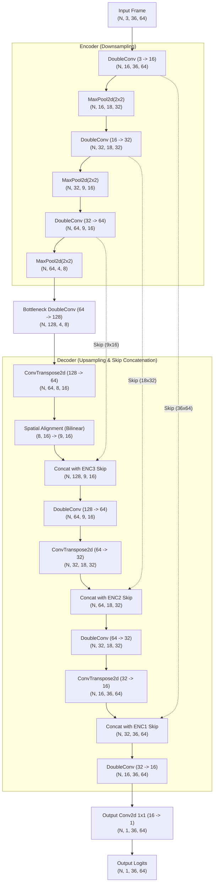

# Custom Lane Segmentation UNet (from scratch) — PSU-Reservoir Dataset

[](https://pytorch.org/)
[](https://python.org/)
[](https://developer.nvidia.com/cuda-zone)
[](LICENSE)

A self-contained, lightweight convolutional neural network for single-class lane segmentation designed and trained completely **from scratch** in PyTorch. 
- **Zero Pretrained Weights**: No pretrained backbones (no ImageNet, no ResNet).
- **Zero External Segmentation Libraries**: Implemented without `segmentation_models_pytorch`, `torchvision.models.segmentation`, or `ultralytics`.
- **Laptop-Friendly**: Ultra-lightweight footprint (~0.48M parameters, ~2 ms latency, <5 MB GPU VRAM).

---

## 1. Project Overview & Dataset Description

### PSU-Reservoir Lane Dataset (Assignment-8)
The dataset consists of **1,000 RGB driving frames** recorded at **1280x720 px** (16:9 native aspect ratio) around the PSU reservoir track, annotated in Ultralytics YOLO polygon format.

- **Annotation Filtering**: The raw label files include mixed annotation primitives:
  - Bounding boxes (5 tokens: `class_id x y w h`) — **ignored**.
  - Polyline centerlines (3 classes) — **ignored**.
  - Lane boundary polygons (`0 x1 y1 x2 y2 ... xn yn`) with $\ge 3$ coordinate pairs — **strictly parsed**.
- **Configurable Lane Class ID**: Default is `--lane-class-id 0`. Lines with fewer than 3 vertices or non-matching class IDs are filtered out.
- **Native-Resolution Rasterization**: To prevent discretization errors, lane polygons are rasterized onto a full $1280 \times 720$ binary mask via `cv2.fillPoly` before joint resizing to network resolution ($64 \times 36$).
- **Dataset Statistics at Startup**:
  - Total frames parsed: **1,000**
  - Frames with empty lane masks: **0 (0.00%)**
  - Mean lane area ratio: **49.65%** (roughly 50% of the frame is driveable lane).

### Deterministic 65:35 Train / Test Split
To guarantee reproducible benchmarking and prevent data contamination:
- **65% Train Split (650 images)**: Saved to [`splits/train.txt`](splits/train.txt).
- **35% Test Split (350 images)**: Saved to [`splits/test.txt`](splits/test.txt).
- **Validation Subset**: A 10% slice (65 images) is carved out of the 65% train pool exclusively for epoch-by-epoch checkpoint selection (`best.pt`).
- **Zero Test Leakage**: The 35% held-out test split is **never** touched during training, tuning, or checkpoint selection.

---

## 2. Neural Network Structure & Architectural Rationale

Detailed block diagrams and layer-by-layer profiling are documented in [custom-unet-architecture.md](custom-unet-architecture.md).



### Architectural Rationale:
1. **Why UNet Architecture**:
   Encoder-decoder segmentation architectures retain global road context while skip connections directly pass early high-resolution spatial feature maps to the decoder, preventing boundary degradation.
2. **Why 64x36 Input Resolution (16:9 Aspect Ratio)**:
   The native video format is $1280 \times 720$ (16:9). Standard square inputs (e.g. $48 \times 48$) squeeze horizontal perspective, warping lane angles. Maintaining $64 \times 36$ preserves true geometry while reducing the tensor size to only 2,304 pixels per channel—ideal for high-speed laptop execution.
3. **Why 3 Downsampling Stages for $H=36$**:
   Successive halving produces $36 \rightarrow 18 \rightarrow 9 \rightarrow 4$. A 4th downsampling step would reduce vertical height to $2$, destroying road perspective. 3 stages preserve spatial context with an $8 \times 4$ bottleneck.
4. **Handling Odd Spatial Dimensions in Upsampling**:
   Because $9 // 2 = 4$, transpose convolution with stride 2 produces height $4 \times 2 = 8$, leaving a 1-pixel mismatch with the skip tensor's height of 9. The custom `Up` module dynamically aligns spatial dimensions (`F.interpolate(x, size=skip.shape[2:], mode="bilinear")`) before concatenation.
5. **Channel Widths & Parameter Budget**:
   Using `base_ch = 16` (`16 -> 32 -> 64 -> 128`), the network has **482,737 trainable parameters (~0.483M)**. This fits well within the 0.5–2M constraint, avoiding overfitting on 1,000 frames.
6. **DoubleConv with BatchNorm & ReLU**:
   Two $3 \times 3$ convolutions expand receptive field depth at each scale. `BatchNorm2d` stabilizes internal covariate shift when training from scratch without pretrained weights.
7. **Loss: BCE + Dice**:
   Binary Cross-Entropy provides smooth pixel-wise gradients, while Soft Dice Loss directly maximizes area overlap:
   $$\mathcal{L}_{\text{total}} = 0.5 \cdot \mathcal{L}_{\text{BCE}} + 0.5 \cdot \mathcal{L}_{\text{Dice}}$$

---

## 3. Loss Convergence & Training History

Training ran for **30 epochs** on local hardware using the Adam optimizer ($\text{lr} = 10^{-3}$, batch size 4).


### Interpretation & Overfitting Analysis:
- **Rapid Convergence (Epochs 1–5)**:
  Training loss plummeted from $0.2357$ (Epoch 1) to $0.0411$ (Epoch 5), with validation IoU surging above $0.978$.
- **Best Generalization Epoch (Epoch 21)**:
  Validation loss achieved its global minimum at **Epoch 21** ($\mathcal{L}_{\text{val}} = 0.0131$, $\text{IoU}_{\text{val}} = 0.9874$). Checkpoint `checkpoints/unet_lane/best.pt` was saved here.
- **Overfitting Behavior**:
  Beyond Epoch 24, training loss continued a slight descent to $0.0143$ while validation loss hovered between $0.016$ and $0.027$. Validation IoU remained consistently above $0.980$, demonstrating excellent stability and absence of severe overfitting.

---

## 4. Performance Metrics (Held-Out 35% Test Set)

The model was evaluated on all **350 held-out test frames** at native **1280x720** resolution using pixel-wise IoU:

$$\text{IoU} = \frac{|\text{Pred} \cap \text{GT}|}{|\text{Pred} \cup \text{GT}|}$$

An image is counted as **Detected (Positive)** if $\text{IoU} \ge 0.60$.

| Metric | Result | Notes |
|---|---|---|
| **Evaluated Test Frames** | **350** | 35% held-out test split |
| **Detection Threshold** | $\text{IoU} \ge 0.60$ | Configurable via `--iou-threshold` |
| **Positive Detected Frames** | **349 / 350** | Only 1 challenging frame below 0.60 |
| **Detection Rate (% Positive)** | **99.71%** | High robustness across diverse frames |
| **Average IoU (Detected Images)** | **0.9339** (93.39%) | Mean overlap on positive detections |
| **Average IoU (All Test Images)** | **0.9329** (93.29%) | Overall benchmark across entire test set |

Full per-image IoU logs are saved in [`test_eval_per_image.csv`](test_eval_per_image.csv) and [`metrics.json`](metrics.json).

---

## 5. Visual Inference Snapshots

Side-by-side comparisons at native $1280 \times 720$ resolution: **Original Frame | Ground Truth Mask (Cyan) | Custom UNet Prediction (Green)**.


Representative test samples from the evaluation:
- **Typical Clean Frame**: IoU > 0.94, exact tracking of lane curve and borders.
- **Challenging Lighting / Curve**: Network accurately infers road curvature even under strong shadows and perspective shifts.

---

## 6. Inference Memory Footprint & Latency Benchmark

Measurements performed on single-frame inference (batch size 1, input $64 \times 36$):

| Metric | GPU (NVIDIA CUDA) | CPU (Host Intel/AMD) |
|---|---|---|
| **Total Parameters** | **482,737** (~0.483M) | **482,737** (~0.483M) |
| **Model Checkpoint Size** | **1.87 MB** | **1.87 MB** |
| **Peak Memory Allocated** | **4.71 MB** (VRAM) | **7.88 MB** (RSS delta) |
| **Average Latency / Frame** | **2.00 ms** | **5.51 ms** |
| **Throughput (FPS)** | **499.8 FPS** | **181.6 FPS** |

*Measured across 500 benchmark iterations with 100 warmup iterations. Logged in [`assets/memory_footprint.json`](assets/memory_footprint.json).*

---

## 7. Setup & How to Run

### Installation
Clone the repository and install required packages:
```bash
pip install -r requirements.txt
```

### Complete Pipeline Commands

#### Step 1: Train Custom UNet (30 Epochs)
```bash
python train.py --data-root ../image/image_1k_fern --epochs 30 --batch-size 4 --run-name unet_lane
```
*Outputs: Checkpoints in `checkpoints/unet_lane/{last,best}.pt`, TensorBoard logs in `runs/unet_lane/`, loss curve in `assets/loss_curve.png`, and split manifests in `splits/`.*

#### Step 2: Predict Masks on 35% Held-Out Test Set
```bash
python predict.py --checkpoint checkpoints/unet_lane/best.pt --data-root ../image/image_1k_fern --splits-dir splits --split test --save-overlay
```
*Outputs: Native 1280x720 binary mask PNGs saved to `result/`, plus visual blended overlays in `result/overlays/`.*

#### Step 3: Evaluate IoU & Detection Rate
```bash
python evaluation.py --result-dir result --data-root ../image/image_1k_fern --splits-dir splits --split test --iou-threshold 0.6
```
*Outputs: Console summary report, `metrics.json`, and `test_eval_per_image.csv`.*

#### Step 4: Benchmark Memory Footprint & Latency
```bash
python benchmark_inference.py --checkpoint checkpoints/unet_lane/best.pt --runs 500
```
*Outputs: JSON report in `assets/memory_footprint.json`.*

#### Step 5: Generate Visual Comparison Snapshots
```bash
python make_snapshot.py --result-dir result --data-root ../image/image_1k_fern --eval-csv test_eval_per_image.csv
```
*Outputs: Side-by-side figures saved in `assets/`.*

---

## 8. Limitations & Honest Engineering Notes

1. **Video Temporal Correlation in Random Splits**:
   The frames originate from sequential video recordings around the reservoir. While a 65:35 deterministic split is standard and test frames were held out, sequential video frames share background lighting and road textures. In commercial deployment, partitioning datasets by completely distinct video runs or days is recommended to test true distribution shifts.
2. **Spatial Boundary Quantization (64x36 Resolution)**:
   Downscaling $1280 \times 720$ down to $64 \times 36$ (a factor of $20 \times$ in each dimension) means a single pixel at network resolution covers $20 \times 20 = 400$ native pixels. While bilinear probability upsampling generates smooth boundaries, distant lane horizons lose sub-pixel sharpness. Increasing input resolution to $128 \times 72$ or $256 \times 144$ would sharpen distant boundaries if more compute budget is available.

---

## 9. References

- [Ultrafast-Lane-Detection-Inference-Pytorch](https://github.com/ibaiGorordo/Ultrafast-Lane-Detection-Inference-Pytorch-)
- [YOLOTL — YOLO Tracking and Lane Detection](https://github.com/Highsky7/YOLOTL)
- Ronneberger et al., *U-Net: Convolutional Networks for Biomedical Image Segmentation*, MICCAI 2015.
