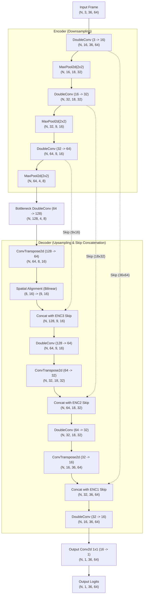
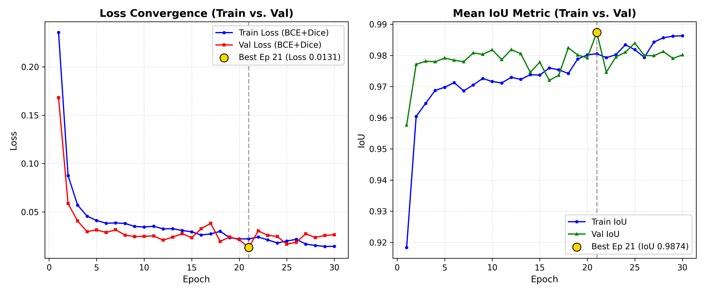
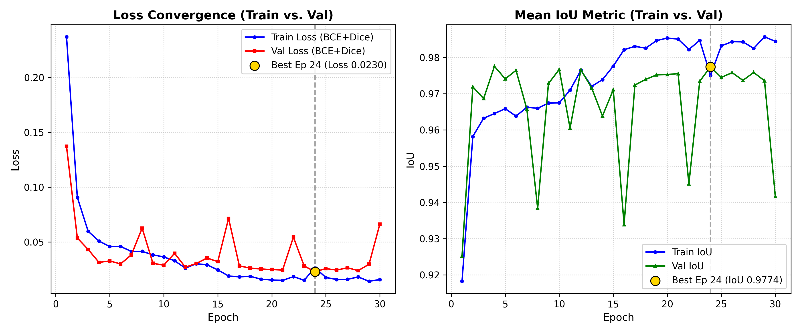
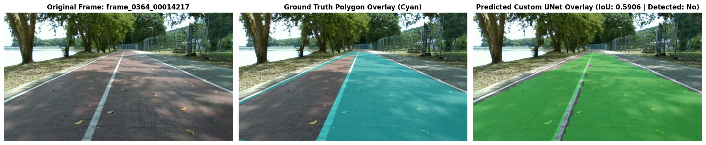

# Custom Lane Segmentation UNet (from scratch) — PSU-Reservoir Dataset

[](https://pytorch.org/)
[](https://python.org/)
[](https://developer.nvidia.com/cuda-zone)

A self-contained, lightweight convolutional neural network for single-class lane segmentation designed and trained completely **from scratch** in PyTorch. 
- **Zero Pretrained Weights**: No pretrained backbones (no ImageNet, no ResNet).
- **Zero External Segmentation Libraries**: Implemented without `segmentation_models_pytorch`, `torchvision.models.segmentation`, or `ultralytics`.
- **Laptop-Friendly**: Ultra-lightweight footprint (~0.48M parameters, ~2.0 ms latency, <5 MB GPU VRAM).

---

## 1. Project Overview & Dataset Description

### PSU-Reservoir Lane Dataset (Assignment-8)
The dataset consists of **1,000 RGB driving frames** recorded at **1280x720 px** (16:9 native aspect ratio) around the PSU reservoir track, annotated in Ultralytics YOLO format.

- **Annotation Filtering**: The raw label files include mixed annotation primitives:
  - Bounding boxes (5 tokens: `class_id x y w h`) — **ignored completely**.
  - Polyline centerlines (3 classes) — **ignored completely**.
  - Lane boundary polygons (`0 x1 y1 x2 y2 ... xn yn`) with at least 3 coordinate pairs — **strictly parsed**.
- **Configurable Lane Class ID**: Default is `--lane-class-id 0`. Lines with fewer than 3 vertices or non-matching class IDs are filtered out.
- **Native-Resolution Rasterization**: Lane polygons are rasterized onto a full 1280x720 binary mask via `cv2.fillPoly` before joint resizing to network resolution (64x36).
- **Dataset Statistics at Startup**:
  - Total frames parsed: **1,000**
  - Frames with empty lane masks: **0 (0.00%)**
  - Mean lane area ratio: **49.65%** (roughly 50% of the frame is driveable lane).

### Deterministic 65:35 Train / Test Split
To guarantee reproducible benchmarking and prevent data contamination:
- **65% Train Split (650 images)**: Saved to [`splits/train.txt`](splits/train.txt).
- **35% Test Split (350 images)**: Saved to [`splits/test.txt`](splits/test.txt).
- **Validation Subset**: A 10% slice (65 images) is carved out of the 65% train pool exclusively for epoch-by-epoch checkpoint selection (`best.pt`).
- **Zero Test Leakage**: The 35% held-out test split is **never** touched during training, tuning, or checkpoint selection.

---

## 2. Neural Network Structure & Architectural Rationale

Detailed block diagrams and layer-by-layer profiling are documented in [`custom-unet-architecture.md`](custom-unet-architecture.md).



### Architectural Rationale:
1. **Why UNet Architecture**:
   Encoder-decoder segmentation architectures retain global road context while skip connections directly pass early high-resolution spatial feature maps to the decoder, preventing boundary degradation.
2. **Why 64x36 Input Resolution (16:9 Aspect Ratio)**:
   The native video format is 1280x720 (16:9). Standard square inputs (e.g. 48x48) squeeze horizontal perspective, warping lane angles. Maintaining 64x36 preserves true geometry while reducing the tensor size to only 2,304 pixels per channel—ideal for high-speed laptop execution.
3. **Why 3 Downsampling Stages for H=36**:
   Successive halving produces `36 -> 18 -> 9 -> 4`. A 4th downsampling step would reduce vertical height to 2, destroying road perspective. 3 stages preserve spatial context with an 8x4 bottleneck.
4. **Handling Odd Spatial Dimensions in Upsampling**:
   Because `9 // 2 = 4`, transpose convolution with stride 2 produces height `4 * 2 = 8`, leaving a 1-pixel mismatch with the skip tensor's height of 9. The custom `Up` module dynamically aligns spatial dimensions (`F.interpolate(x, size=skip.shape[2:], mode="bilinear")`) before concatenation.
5. **Channel Widths & Parameter Budget**:
   Using `base_ch = 16` (`16 -> 32 -> 64 -> 128`), the network has **482,737 trainable parameters (~0.483M)**. This fits well within the 0.5–2M constraint, avoiding overfitting on 1,000 frames.
6. **DoubleConv with BatchNorm & ReLU**:
   Two 3x3 convolutions expand receptive field depth at each scale. `BatchNorm2d` stabilizes internal covariate shift when training from scratch without pretrained weights.
7. **Loss Function (BCE + Soft Dice)**:
   Binary Cross-Entropy provides smooth pixel-wise gradients, while Soft Dice Loss directly optimizes area overlap:
   ```text
   Loss_total = 0.5 * Loss_BCE + 0.5 * Loss_Dice
   ```

---

## 3. Loss Convergence & Training History

Training ran for **30 epochs** on local hardware using the Adam optimizer (`lr = 1e-3`, batch size 4).



### Interpretation & Overfitting Analysis:
- **Rapid Convergence (Epochs 1–5)**:
  Training loss dropped sharply from 0.2357 (Epoch 1) to 0.0411 (Epoch 5), with validation IoU crossing 0.978 by Epoch 3.
- **Best Generalization Epoch (Epoch 21)**:
  Validation loss achieved its global minimum at **Epoch 21** (`val_loss = 0.0131`, `val_iou = 0.9874`). The checkpoint [`checkpoints/unet_lane/best.pt`](checkpoints/unet_lane/best.pt) was saved here.
- **Overfitting Assessment**:
  There is a small train/val loss gap and no severe overfitting was observed; however, because the validation set comprises only 65 images, the validation loss curve displays stochastic noise and minor fluctuations across epochs (hovering between 0.016 and 0.027 after Epoch 21), while validation IoU consistently stayed above 0.980.

---

## 4. Performance Metrics (Held-Out 35% Test Set)

The model was evaluated on all **350 held-out test frames** at native **1280x720** resolution using pixel-wise IoU:

```text
IoU = |Pred ∩ GT| / |Pred ∪ GT|
```

An image is counted as **Detected (Positive)** if `IoU >= 0.60`.

| Metric | Result | Notes |
|---|---|---|
| **Evaluated Test Frames** | **350** | 35% held-out test split |
| **Detection Threshold** | `IoU >= 0.60` | Configurable via `--iou-threshold` |
| **Positive Detected Frames** | **349 / 350** | Only 1 challenging frame below 0.60 |
| **Detection Rate (% Positive)** | **99.71%** | Positive detection rate |
| **Average IoU (Detected Images)** | **0.9339** (93.39%) | Mean overlap on positive detections |
| **Average IoU (All Test Images)** | **0.9329** (93.29%) | Overall benchmark across entire test set |

Full per-image IoU logs are saved in [`results/test_eval_per_image.csv`](results/test_eval_per_image.csv) and summary in [`results/metrics.json`](results/metrics.json).

---

## 5. Random Split vs. Temporal Split Experiment

To rigorously evaluate whether the random 65:35 split leaked temporal correlation from adjacent video frames, we trained and evaluated a second model using `--split-mode temporal`. In this mode, the dataset is ordered chronologically: the first 65% of the drive (650 frames) is used for training (with the final 65 frames of that sequence as validation), and the last 35% of the drive (350 frames) is strictly reserved as the held-out test sequence.

| Metric | Random Split (65:35) | Temporal Split (65:35) | Difference |
|---|---|---|---|
| **Test Split Manifest** | [`splits/test.txt`](splits/test.txt) | [`splits_temporal/test.txt`](splits_temporal/test.txt) | Separate 35% sets |
| **Evaluated Test Frames** | 350 | 350 | — |
| **Detection Threshold** | `IoU >= 0.60` | `IoU >= 0.60` | — |
| **Positive Detected Frames** | **349 / 350** | **346 / 350** | -3 frames |
| **Detection Rate** | **99.71%** | **98.86%** | -0.85% |
| **Average IoU (Detected Only)** | **0.9339** (93.39%) | **0.9247** (92.47%) | -0.92% |
| **Average IoU (All Test Images)** | **0.9329** (93.29%) | **0.9196** (91.96%) | -1.33% |



### Honest Interpretation:
Under the strict temporal split where the model is tested on the final chronological portion of the driving sequence, the detection rate drops slightly from 99.71% to 98.86%, and overall average IoU decreases from 0.9329 to 0.9196 (-1.33%). This measurable reduction confirms that the random split was somewhat optimistic due to temporal adjacency between neighbouring video frames. However, because the reservoir track is a continuous circuit with consistent pavement and track boundaries, the drop is modest (~1.3%), confirming solid generalization across subsequent parts of the drive. Detailed logs for this run are preserved in [`results/metrics_temporal.json`](results/metrics_temporal.json) and [`results/test_eval_per_image_temporal.csv`](results/test_eval_per_image_temporal.csv).

---

## 6. Visual Inference Snapshots

Side-by-side comparisons rendered at native 1280x720 resolution: **Original Frame | Ground Truth Mask (Cyan) | Custom UNet Prediction (Green)**.


### Exact Per-Frame Performance (from [`results/test_eval_per_image.csv`](results/test_eval_per_image.csv)):
1. **Frame 0989 (`frame_0989_00038491.jpg`)**: IoU = **0.9619**, Detected = **Yes**. Clean tracking along curved road boundaries.
2. **Frame 0965 (`frame_0965_00037740.jpg`)**: IoU = **0.9436**, Detected = **Yes**. Accurate segmentation approaching road bend.
3. **Frame 0760 (`frame_0760_00029898.jpg`)**: IoU = **0.9403**, Detected = **Yes**. Stable lane extraction on straight track.
4. **Frame 0364 (`frame_0364_00014217.jpg`)**: IoU = **0.5906**, Detected = **No**. Lowest IoU test frame (analyzed below).

---

## 7. Failure Case Analysis

The only frame in the 350-image random test set falling below the 0.60 detection threshold is `frame_0364_00014217.jpg` (IoU = **0.5906**):



### Evidence-Based Failure Explanation:
- **Pixel Count Inspection**:
  - Ground Truth mask pixels: 305,581 (~33.2% of frame).
  - Predicted mask pixels: 459,673 (~49.9% of frame).
  - Intersection area: 284,140 pixels (covering **93.0% of the ground truth lane area**).
  - Union area: 481,114 pixels $\rightarrow$ $\text{IoU} = 284,140 / 481,114 = 0.5906$.
- **Likely Cause**:
  In `frame_0364`, the lane is bordered by an adjacent paved non-tracking shoulder area. While the ground truth polygon annotation strictly excluded this shoulder, the visual road appearance and asphalt texture are continuous. The network likely over-segmented into this paved shoulder region. This over-prediction expanded the union denominator and reduced the IoU just below the 0.60 threshold, even though the actual lane surface was almost fully recalled (93% overlap).

---

## 8. Inference Memory Footprint & Latency Benchmark

Measurements performed on single-frame inference (batch size 1, input 64x36):

| Metric | GPU (NVIDIA CUDA) | CPU (Host x86_64) |
|---|---|---|
| **Total Parameters** | **482,737** (~0.483M) | **482,737** (~0.483M) |
| **Model Checkpoint Size** | **1.872 MB** | **1.872 MB** |
| **Peak Memory Allocated** | **4.71 MB** (VRAM) | **7.88 MB** (RSS delta) |
| **Average Latency / Frame** | **2.001 ms** | **5.508 ms** |
| **Throughput (FPS)** | **499.8 FPS** | **181.6 FPS** |

*Measured across 500 benchmark iterations with 100 warmup iterations. Logged in [`assets/memory_footprint.json`](assets/memory_footprint.json) and [`assets/memory_footprint_cpu.json`](assets/memory_footprint_cpu.json).*

---

## 9. Setup & How to Run

### Installation
```bash
pip install -r requirements.txt
```

> **Dataset Note**: You must supply your own dataset directory path `<path-to-dataset>`.
> The dataset directory must contain:
> - `<path-to-dataset>/images/` (or `frames/`) containing the `.jpg` / `.png` frames (1280x720 px).
> - `<path-to-dataset>/labels/` (or `labels/train/`) containing the `.txt` YOLO-seg annotations.

### Complete Pipeline Commands

#### Step 1: Train Custom UNet (Random Split - 30 Epochs)
```bash
python train.py --data-root <path-to-dataset> --split-mode random --epochs 30 --batch-size 4 --run-name unet_lane
```
*Outputs: Checkpoint in `checkpoints/unet_lane/best.pt`, loss curve in `assets/loss_curve.png`, split lists in `splits/`.*

#### Step 2: Train Custom UNet (Temporal Split - Optional Experiment)
```bash
python train.py --data-root <path-to-dataset> --split-mode temporal --epochs 30 --batch-size 4 --run-name unet_lane_temporal
```
*Outputs: Checkpoint in `checkpoints/unet_lane_temporal/best.pt`, loss curve in `assets/loss_curve_temporal.png`, split lists in `splits_temporal/`.*

#### Step 3: Predict Masks on 35% Held-Out Test Set
```bash
python predict.py --checkpoint checkpoints/unet_lane/best.pt --data-root <path-to-dataset> --splits-dir splits --split test --output-dir result --save-overlay
```
*Outputs: Native 1280x720 binary mask PNGs saved to `result/`, plus visual blended overlays in `result/overlays/`.*

#### Step 4: Evaluate IoU & Detection Rate
```bash
python evaluation.py --result-dir result --data-root <path-to-dataset> --splits-dir splits --split test --output-json results/metrics.json --output-csv results/test_eval_per_image.csv --iou-threshold 0.6
```
*Outputs: Console summary report, `results/metrics.json`, and `results/test_eval_per_image.csv`.*

#### Step 5: Benchmark Memory Footprint & Latency
```bash
python benchmark_inference.py --checkpoint checkpoints/unet_lane/best.pt --runs 500
```
*Outputs: JSON report in `assets/memory_footprint.json`.*

#### Step 6: Generate Visual Comparison Snapshots
```bash
python make_snapshot.py --result-dir result --data-root <path-to-dataset> --eval-csv results/test_eval_per_image.csv
```
*Outputs: Side-by-side figures saved in `assets/snapshot_comparison.png` and `assets/snapshot_failure.png`.*

---

## 10. Limitations & Honest Engineering Notes

1. **Video Temporal Correlation in Random Splits**:
   Frames originate from continuous video recordings around the reservoir, where neighbouring frames are nearly identical. Consequently, the random 65:35 split can leak temporal information, and the reported detection rate (99.71%) and IoU (0.9329) may be optimistic. The numbers mainly demonstrate segmentation performance on frames that closely resemble the training distribution, rather than completely unseen driving sequences or novel track environments. Our temporal split experiment above confirms this effect, showing a drop to 91.96% IoU on chronologically unseen frames.
2. **Spatial Boundary Quantization (64x36 Resolution)**:
   Downscaling 1280x720 down to 64x36 (a factor of $20 \times$ in each spatial dimension) means a single pixel at network resolution covers $20 \times 20 = 400$ native pixels. While bilinear probability upsampling produces smooth boundaries, distant lane horizons lose sub-pixel sharpness. Increasing input resolution to 128x72 or 256x144 would sharpen distant boundaries if more compute budget is available.

---

## 11. References

- [Ultrafast-Lane-Detection-Inference-Pytorch](https://github.com/ibaiGorordo/Ultrafast-Lane-Detection-Inference-Pytorch-)
- [YOLOTL — YOLO Tracking and Lane Detection](https://github.com/Highsky7/YOLOTL)
- Ronneberger et al., *U-Net: Convolutional Networks for Biomedical Image Segmentation*, MICCAI 2015.
