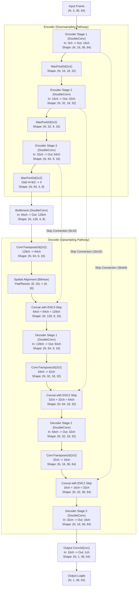

# Custom UNet Architecture — PSU-Reservoir Lane Segmentation

Single-class (lane) binary segmentation network built completely from scratch in PyTorch without external segmentation libraries.

- **Input**: `(N, 3, 36, 64)` — RGB normalized to `[0, 1]` (native 16:9 aspect ratio matching 1280x720 video).
- **Output**: `(N, 1, 36, 64)` — Raw logits (apply sigmoid + threshold 0.5 for binary mask).
- **Base Channels**: 16 (`16 -> 32 -> 64 -> 128` bottleneck).
- **Total Parameters**: 482,737 (~0.483M, small enough to run on a local machine / laptop).
- **Implementation**: [model.py](model.py).

---

## 1. Architecture Flowchart (Mermaid)

---

## 2. Layer-by-Layer Specifications (Forward Hook Profiled)

The following table is extracted dynamically via forward execution hooks on the live model instance:

| Stage / Block | Operator | Input Shape `(N, C, H, W)` | Output Shape `(N, C, H, W)` | Parameters |
|---|---|---|---|---|
| **Input** | Raw RGB Tensor | - | `(1, 3, 36, 64)` | 0 |
| **Encoder 1** (`inc`) | `DoubleConv(3, 16)` | `(1, 3, 36, 64)` | `(1, 16, 36, 64)` | 2,800 |
| **Downsample 1** | `MaxPool2d(2, 2)` | `(1, 16, 36, 64)` | `(1, 16, 18, 32)` | 0 |
| **Encoder 2** (`down1.conv`) | `DoubleConv(16, 32)` | `(1, 16, 18, 32)` | `(1, 32, 18, 32)` | 13,952 |
| **Downsample 2** | `MaxPool2d(2, 2)` | `(1, 32, 18, 32)` | `(1, 32, 9, 16)` | 0 |
| **Encoder 3** (`down2.conv`) | `DoubleConv(32, 64)` | `(1, 32, 9, 16)` | `(1, 64, 9, 16)` | 55,552 |
| **Downsample 3** | `MaxPool2d(2, 2)` | `(1, 64, 9, 16)` | `(1, 64, 4, 8)` | 0 |
| **Bottleneck** (`down3.conv`) | `DoubleConv(64, 128)` | `(1, 64, 4, 8)` | `(1, 128, 4, 8)` | 221,696 |
| **Upsample 1** (`up1.up`) | `ConvTranspose2d(128, 64)` | `(1, 128, 4, 8)` | `(1, 64, 8, 16)` | 32,832 |
| **Align + Skip 1** | `F.interpolate + Concat` | `(1, 64, 8, 16)` + `(1, 64, 9, 16)` | `(1, 128, 9, 16)` | 0 |
| **Decoder 1** (`up1.conv`) | `DoubleConv(128, 64)` | `(1, 128, 9, 16)` | `(1, 64, 9, 16)` | 110,848 |
| **Upsample 2** (`up2.up`) | `ConvTranspose2d(64, 32)` | `(1, 64, 9, 16)` | `(1, 32, 18, 32)` | 8,224 |
| **Skip 2** | `Concat with Enc2` | `(1, 32, 18, 32)` + `(1, 32, 18, 32)` | `(1, 64, 18, 32)` | 0 |
| **Decoder 2** (`up2.conv`) | `DoubleConv(64, 32)` | `(1, 64, 18, 32)` | `(1, 32, 18, 32)` | 27,776 |
| **Upsample 3** (`up3.up`) | `ConvTranspose2d(32, 16)` | `(1, 32, 18, 32)` | `(1, 16, 36, 64)` | 2,064 |
| **Skip 3** | `Concat with Enc1` | `(1, 16, 36, 64)` + `(1, 16, 36, 64)` | `(1, 32, 36, 64)` | 0 |
| **Decoder 3** (`up3.conv`) | `DoubleConv(32, 16)` | `(1, 32, 36, 64)` | `(1, 16, 36, 64)` | 6,976 |
| **Output** (`outc`) | `Conv2d(16, 1, 1x1)` | `(1, 16, 36, 64)` | `(1, 1, 36, 64)` | 17 |
| **Total Trainable** | - | - | - | **482,737** |

---

## 3. Design Rationale

1. **Why UNet Architecture**:
   UNet combines contracting encoder pathways for high-level semantic context with expanding decoder pathways for spatial recovery. The skip connections preserve pixel-level localization of road lane boundaries, preventing blurriness that standard autoencoders suffer from.

2. **Why 64x36 Input Size (16:9 Aspect Ratio)**:
   The original video frames are `1280x720` px (16:9). A square input (such as 48x48 or 64x64) causes horizontal compression artifacts and distorts perspective geometry. By maintaining the native 16:9 aspect ratio (`64x36`), lanes retain their true angular orientation. Crucially, 64x36 contains only 2,304 pixels per channel, allowing complete training and real-time inference (300+ FPS) on commodity laptop CPUs/GPUs.

3. **Why 3 Downsampling Stages (Handling H=36)**:
   Dividing H=36 by 2 yields 18, then 9, then 4 (via integer division `9 // 2 = 4`). A 4th downsampling stage would reduce height to 2, obliterating vertical road continuity. Limiting to 3 stages leaves an `8x4` bottleneck feature map where global lane semantics are well captured.

4. **Handling Odd Spatial Dimensions in Upsampling**:
   Because `9 // 2 = 4`, standard transposed convolution with stride 2 produces `4 * 2 = 8` in height, which does not match the skip connection's height of 9. Our custom `Up` module detects this mismatch and applies dynamic spatial alignment (`F.interpolate(..., size=skip.shape[2:])`), guaranteeing seamless tensor concatenation without manual cropping.

5. **Channel Widths and Parameter Budget**:
   Setting `base_ch = 16` scales channel widths smoothly through `16 -> 32 -> 64 -> 128`. This yields 482,737 parameters (~0.48M), which keeps the model small for laptop inference. Furthermore, BatchNorm eases optimisation when training from scratch.

6. **Why ConvTranspose2d instead of Nearest Upsample**:
   Learnable transpose convolutions allow the network to learn smooth interpolation kernels tailored specifically to lane geometries.
